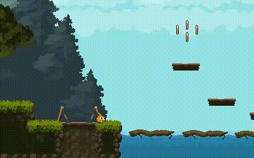

# Passo a passo para fazer plataformas :arrow_down: :left_right_arrow: :arrow_up_down: 



## vamos construir 3 tipos de plataformas e uma bônus :star:

- Plataforma fixa (a mais comum de todas).
- Plataforma de queda ao detectar colisão com jogador;
- Plataforma de movimento na horizontal ou vertical;
- BÔNUS: Uma plataforma de queda um pouquinho diferente! :smile:  

### Pacote de sprites utilizadas:   
- [Anokolisa - Legacy Fantasy Bundle](https://anokolisa.itch.io/sidescroller-pixelart-sprites-asset-pack-forest-16x16)  
- [GrafxKid - Sprite Pack 6](https://grafxkid.itch.io/sprite-pack-6)  
- [GrafxKid - Mini FX, Items & UI](https://grafxkid.itch.io/mini-fx-items-ui)  

> [!NOTE]
> Necessário download da [Godot 4.2](https://godotengine.org/download/windows/)  para abrir o projeto e poder executar, modificar e criar.

## 1ª Plataforma: plataforma fixa

Esse é o tipo mais básico e comum de plataforma. Para criá-la vamos criar uma nova cena e adicionar os seguintes nós:

- StaticBody2D
    - Sprite2D
    - CollisionShape2D

Renomeei os nós com os seguintes nomes:


#### Próximos passos:

- Adicione ao nó `sprite` uma imagem para ser sua plataforma na aba `Inspector/Texture`;
- Ao nó `collision` determine qual será o shape de colisão que melhor se encaixe à sprite da plataforma. Vá para a aba `Inspector/Shape` e escolha a melhor forma para colisão. Eu escolhi para a minha plataforma o shape `RectangleShape2D`.
- Ainda no nó `collision` deixe habilitado a propriedade `One Way Collision`. Essa configuração permitirá ao jogador saltar para a plataforma de baixo para cima, mas não cair através dela de cima para baixo.

A imagem a seguir exemplifica a configuração do nó de colisão:


Com isso feito, nossa primeira plataforma já está feita. Agora basta instanciar a cena `platform` como filho do nó raiz da cena principal, por exemplo, cena de fase ou nível. Nesse projeto está como: `world_01` e então é só posicionar a plataforma no local que quiser na cena de seu jogo. :wink:

## 2ª Plataforma: plataforma de queda :arrow_down:

Essa plataforma reage à interação do jogador, caindo e depois retornando à sua posição original após um tempo.

Após criar uma nova cena, vamos aos nós que ela terá:

- RigidBody2D
    - Sprite2D
    - CollisionShape2D
    - Timer
    - Area2D
        - CollisionShape2D
    - AnimationPlayer

Renomeei os nós com os seguintes nomes:


Após adicionar ao nó `sprite` uma imagem que será sua plataforma de queda, vamos às colisões.

Teremos 2 colisões (como ilustrado na imagem a seguir):


- A colisão em verde representa o colisor da plataforma com o personagem;
- A colisão em vermelho indica o colisor da área do nó `body_detector`. Esse  colisor que dirá se o personagem entrou em contato com a plataforma para que ela caia;
- Não esqueça de especificar a camada em que o nó está e com quem ele colidirá.

> [!NOTE]
> É importante que o colisor do nó 'Area2D' fique acima do colisor do nó raiz, para que não haja interferências na detecção do personagem e não acabe ocasionando erro na queda da plataforma.

### Animação de alerta

Assim que o jogador colidir com a plataforma, ela vai tremer, informando ao jogador que ela vai cair e que ele precisa sair daquela plataforma. Esse tipo de alerta melhora a experiência do jogador ao ser avisado de possíveis acontecimentos enquanto ele joga.

Para fazer essa animação vamos ao nó `anim` criar uma nova animação `alert`. Vamos trabalhar com a propriedade `Position` do nó `sprite`.
- Crie a animação `alert`;
- Determine o tempo de animação (eu coloquei 0.4);
- Deixe ativado o botão de `Animation Looping` (aparecerá inicialmente com o símbolo de Looping :repeat:, clique novamente até mudar a imagem para um simbolo assim    :left_right_arrow:); 
- Selecione o nó `sprite` e vá na aba `Inspector/Position`;
- Agora clique na :old_key: da propriedade `Position`, isso adicionará um novo ponto na linha de animação;
- Agora repita isso para os instantes de tempo `0.1 --> x = 2`, `0.2 --> x = 0`, `0.3 --> x = -2` e `0.4 --> x = 0`. Os valores de X são os valores da propriedade `Position` no eixo X. Não esqueça de sempre finalizar a alteração de um valor clicando na chave da propriedade para que as alterações sejam salvas na linha do tempo da animação. 

A imagem abaixo exemplifica a linha do tempo da animação e as propriedades citadas como o tempo, o lopping e posição no eixo x para que você se localize melhor dentro da engine:


### Agora vamos criar o Spript da cena e Sinais necessários:

No nó `fall_platform_respawn` crie um novo script e adicione a ele dois sinais:
- Adicione ao script o sinal `body_entered(body: Node2D)` do nó `body_detector`;
- Adicione ao script o sinal `timeout()` do nó `respawn_timer`.

#### Não sabe adicionar sinais? Sem problema, é bem simples. Vamos lá!

- Selecione o nó desejado, por exemplo `respawn_detector (Timer)`;
- Na aba de propriedades temos `Inspector - Node - History`, clique em `Node`;
- Teremos `Signals` e `Groups`, clique em `Signals` se já não estiver selecionado;
- Procure o sinal desejado, no caso do nó `respawn_detector` queremos o sinal `timeout()`, clique duas vezes no sinal;
- Uma janela para conectar esse sinal a um método será aberta;
- Selecione o nó com o script que fará uso desse sinal (nesse caso o nó `fall_platform_respawn`);
- Clique em `Connect` e então é só partir para o script! :wink:

### Vamos ao código:

```gd
extends RigidBody2D

@onready var respawn_position = self.global_position
@onready var anim = $anim
```
- A classe do script herda de RigidBody2D;
- `respawn_position` armazena a posição inicial da plataforma;
- `anim` referencia o nó de animação `AnimationPlayer` cujo nome foi renomeado para `anim`.

```gd
func _on_body_detector_body_entered(body):
    if body.name == "player":
        anim.play("alert")
        await get_tree().create_timer(1).timeout
        set_deferred("freeze", false)
        $respawn_timer.start()
```
- A função `_on_body_detector_body_entered(body)` é chamada quando um corpo entra na área de detecção do nó `body_detector`;
- Primeiro, verifica se o corpo que entrou é o jogador;
- Se for, executa a animação de alerta, indicando que a plataforma vai cair;
- Aguarda 1 segundo;
- Define `freeze` como `false` (Se a propriedade `freeze` for verdadeira, o corpo fica congelado. A gravidade e a forças não são aplicadas, por isso é importante definir `false` quando quiser que a plataforma sofra com gravidade e outras forças);
-  Inicia um temporizador `(respawn_timer)` para a plataforma se reposicionar depois de cair.

```gd
func respawn_platform():
    global_position = respawn_position
    anim.play("RESET")
    set_deferred("freeze", true)
```
- A função `respawn_platform()` Define o comportamento para reposicionar a plataforma após a queda;
- `global_position = respawn_position:` Reposiciona a plataforma na posição inicial;
- `anim.play("RESET"):` Toca a animação de reset para a plataforma;
- `set_deferred("freeze", true):` Define freeze como true novamente, para que a plataforma fique congelada em sua posição inicial até a próxima colisão com o jogador.

```gd
func _on_respawn_timer_timeout():
    respawn_platform()
```
- A função `_on_respawn_timer_timeout():` é chamada quando o temporizador `(respawn_timer)` expira;
- `respawn_platform():` Chama a função `respawn_platform()` para reposicionar e "resetar" a plataforma.

## 3ª Plataforma: plataforma de movimento horizontal e vertical :left_right_arrow: :arrow_up_down: 

Chegamos na 3ª plataforma desse tutorial. Essa plataforma móvel tem direção no eixo X e Y é essa direção é escolhida de forma muito simples através de uma variavél externa na qual escolhemos o eixo de movimento de nossa plataforma.

Após criar uma nova cena para essa plataforma diferente das anteriores, vamos aos nós:

- AnimatableBody2D
    - CollisionShape2D
    - Sprite2D

Após renomeá-los, a árvore ficou assim:


#### Próximos passos:
- Escolha sua sprite de plataforma;
- Defina a forma do colisor mais ideal para a sua plataforma;
- Não esqueça de ativar `One Way Collision` nas propriedades do nó `CollisionShape2D` caso você deseje que o personagem não sofra colisão ao pular na plataforma de baixo para cima;
- Crie um script para o nó `AnimatableBody2D`.

Agora que criamos uma cena para a plataforma, vamos instanciá-la  `(Atalho: <kbd>Ctrl</kbd>+<kbd>Shift</kbd>+<kbd>A</kbd>)` :link: em nossa cena principal e adicionar um novo nó filho a essa plataforma, como exemplifica a imagem a seguir:


